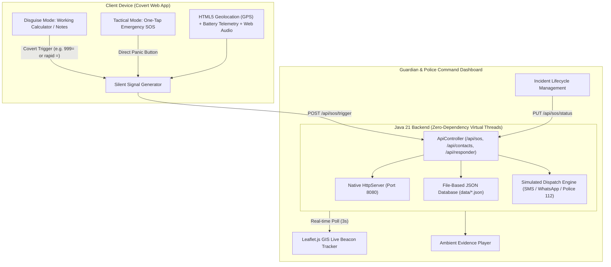

# 🚨 Silent-SOS: Covert Emergency Distress & Personal Safety System

> **B.Tech Computer Science & Engineering Microproject**  
> **Tech Stack:** Java 21 (Virtual Threads REST Server) • HTML5 Geolocation & MediaRecorder • Leaflet.js (OpenStreetMap) • Vanilla CSS3 & JS

---

## 📌 Abstract & Problem Statement

In hostile distress situations—such as stalking, kidnapping, domestic abuse, hostage scenarios, or sudden street violence—attempting to unlock a smartphone, dial an emergency number, or open a brightly colored emergency app often alerts the perpetrator and significantly escalates danger to the victim.

**Silent-SOS** solves this critical safety challenge by providing a **dual-layer covert emergency response platform**:
1. **Client Disguise Front-End:** To an outside observer or attacker, the smartphone displays an authentic, fully working **Calculator application**. When the user types a discreet code (e.g. `999=`) or executes a covert gesture (such as rapid tap on `=`), the system silently captures GPS coordinates, device battery health, and ambient microphone audio, dispatching an immediate SOS beacon without any visual clue, flash, or audible alarm.
2. **Guardian & Police Command Dashboard:** First responders, campus security, or family guardians access a live GIS tracking interface with interactive OpenStreetMap markers, ambient audio playback, victim battery telemetry, and triage workflow (Acknowledge, Dispatched, Resolved).

---

## 🏗️ System Architecture



---

## ✨ Key Features

- 💎 **Unified Luxury Glassmorphic Architecture:**
  - Modern dark glassmorphism with `backdrop-filter: blur(24px)`, specular border highlights, and ambient light meshes.
  - Interactive **Liquid Glass Buttons** with dynamic sheen reflection, tactile depression states, and fluid multi-ring pulse animations.
  - Seamless single-page tab navigation across all 4 operational modes without page reloads.
- 🧮 **Authentic Covert Disguise (Stealth Mode):**
  - Fully functional arithmetic liquid glass calculator.
  - Secret covert triggers: typing `999=`, `911=`, `112=`, or pressing `=` 3 times quickly activates SOS silently.
  - Microscopic status beacon and subtle haptic feedback without alerting observers.
  - **Quick Camouflage Key (`Esc`)**: Instantly snaps to the calculator disguise from anywhere with 1 keystroke.
- ⚡ **Tactical Emergency SOS Panel:**
  - Giant pulsing liquid glass panic sphere for immediate crisis broadcasting.
  - **5-Second Liquid Progress Countdown Ring (Accidental Trigger Prevention)**: Apple Watch style cancellation window with one-tap *"Cancel SOS (False Alarm)"* button.
  - Threat severity classification: *🔴 Critical*, *🟠 Suspicious / Stalked*, *🟡 Harassment / Unsafe*, *🔵 Medical Emergency*.
  - User notes field for vehicle plates or perpetrator descriptions.
- 📍 **Sensor & Acoustic Evidence Capture:**
  - High-precision GPS latitude, longitude, and accuracy radius via HTML5 Geolocation.
  - Ambient microphone recording with **Live Animated Audio Waveform Equalizer**.
  - Real-time device battery percentage and charging telemetry.
- 👮 **Integrated Tactical Military GIS Command Center:**
  - **Tactical Dark Matter Map Layer** with animated **Sonar / Radar Beacons** radiating outward from victim locations.
  - Real-time incident triage controls: `Acknowledge`, `Dispatch Unit`, `Resolve Case`.
  - Ambient audio evidence player directly within incident cards.
  - **Simulated WhatsApp / Lockscreen Mobile Push Alert Banner**: Real-time push notification mockup showing guardians receiving emergency signals.
- 🛰️ **Live Telemetry HUD Command Ticker:**
  - Top command bar with real-time operational status (`SYSTEM: ARMED`, `GPS: LOCKED`, `BATTERY %`, `ACTIVE BEACONS`).
- 👥 **Emergency Guardians Directory:**
  - Full CRUD contact management for family, campus security wardens, and emergency services.
- ☕ **High-Performance Java 21 Backend:**
  - Powered by Java 21 **Virtual Threads** (`Executors.newVirtualThreadPerTaskExecutor()`) for scalable, lightweight concurrency.
  - **Zero external JAR dependencies**: runs natively on standard OpenJDK without Maven/Gradle configuration headaches.
  - Persistent JSON ledger (`data/alerts.json` and `data/contacts.json`) retaining incidents across reboots.

---

## 📂 Project Structure

```
silent-sos/
├── .vscode/
│   ├── launch.json              # VS Code F5 Run & Debug configuration
│   └── settings.json            # Java classpath settings for VS Code
├── src/
│   └── main/
│       ├── java/
│       │   └── com/
│       │       └── silentsos/
│       │           ├── Main.java                 # HTTP Server & Virtual Threads entry point
│       │           ├── controller/
│       │           │   └── ApiController.java    # REST API & Static asset server
│       │           ├── model/
│       │           │   ├── Alert.java            # SOS Incident data model
│       │           │   └── Contact.java          # Emergency Contact data model
│       │           ├── service/
│       │           │   ├── SosService.java       # Dispatch logic & triage
│       │           │   └── ContactService.java   # Contact persistence
│       │           └── util/
│       │               └── JsonUtils.java        # Zero-dependency JSON serializer & parser
│       └── resources/
│           └── static/
│               ├── index.html                    # Client App (Disguise Calculator & Tactical SOS)
│               ├── responder.html                # Police / Guardian Command Center
│               ├── css/
│               │   ├── style.css                 # Client styling
│               │   └── responder.css             # Command center dashboard styling
│               └── js/
│                   ├── app.js                    # Calculator, telemetry, audio & SOS trigger logic
│                   └── responder.js              # Live map & triage controller
├── data/                                         # Persistent storage (auto-seeded)
│   ├── alerts.json
│   └── contacts.json
├── pom.xml                                       # Standard Maven specification (academic evaluation)
├── run.bat                                       # Windows 1-Click Launch Script
├── run.ps1                                       # PowerShell Launch Script
├── .gitignore                                    # Git ignore rules for clean repository
└── README.md                                     # Project Documentation & Viva Guide
```

---

## 🚀 How to Run in VS Code

### Prerequisites:
- **Java Development Kit (JDK 21 or higher)** installed on your machine (`java -version`).
- **VS Code** with the **Extension Pack for Java** (recommended).

### Method 1: Using the Built-in Terminal in VS Code (Easiest)
1. Open **VS Code**.
2. Click **File > Open Folder...** and select this `silent-sos` folder.
3. Open a terminal in VS Code (`Ctrl + ~` or **Terminal > New Terminal**).
4. Run the batch runner:
   ```cmd
   .\run.bat
   ```
   *Or on PowerShell:*
   ```powershell
   .\run.ps1
   ```

### Method 2: One-Click Run via VS Code Run & Debug
1. Open the project folder in VS Code.
2. Open [Main.java](src/main/java/com/silentsos/Main.java).
3. Click the **"Run"** or **"Play"** button at the top right of the editor (or press `F5`).

### Access the Application:
- **Client Covert App (Calculator & SOS):** [http://localhost:8080/](http://localhost:8080/)
- **Guardian & Police Command Dashboard:** [http://localhost:8080/responder.html](http://localhost:8080/responder.html)
- **API Health Endpoint:** [http://localhost:8080/api/system/health](http://localhost:8080/api/system/health)

---

## 🌐 REST API Specification

| Method | Endpoint | Description |
| :--- | :--- | :--- |
| `GET` | `/api/system/health` | Verifies server status, uptime, and Java version |
| `POST` | `/api/sos/trigger` | Dispatches covert/direct emergency alert with telemetry & audio |
| `GET` | `/api/sos/alerts` | Fetches all recorded emergency incidents |
| `PUT` | `/api/sos/status?id={id}&status={status}` | Updates triage status (`ACKNOWLEDGED`, `DISPATCHED`, `RESOLVED`) |
| `GET` | `/api/sos/stats` | Retrieves metrics (active signals, dispatched units, resolved cases) |
| `POST` | `/api/sos/test` | Generates a demonstration incident for viva evaluations |
| `GET` | `/api/contacts` | Lists registered emergency guardians |
| `POST` | `/api/contacts` | Adds a new emergency guardian |
| `DELETE`| `/api/contacts?id={id}` | Removes an emergency contact |

---

## 📤 How to Push to GitHub

Follow these simple steps from the VS Code terminal inside the `silent-sos` folder:

```bash
# 1. Initialize git repository
git init

# 2. Stage all files (respects .gitignore)
git add .

# 3. Create your first commit
git commit -m "feat: Initial commit of Silent-SOS Java microproject"

# 4. Set default branch to main
git branch -M main

# 5. Link to your GitHub repository (replace YOUR_USERNAME and REPO_NAME)
git remote add origin https://github.com/YOUR_USERNAME/silent-sos.git

# 6. Push code to GitHub
git push -u origin main
```

---

## 🎓 Viva Voce & Academic Defense Q&A

**Q1: Why did you choose Java 21 Virtual Threads (Project Loom) for this backend?**  
*Answer:* Traditional Java platform threads are mapped 1:1 with operating system threads, consuming roughly 1MB of stack memory each. Java 21 Virtual Threads are managed by the JVM and run on carrier threads, consuming only a few hundred bytes. This enables our emergency server to handle thousands of concurrent distress beacons with ultra-low latency and minimal resource overhead.

**Q2: How does the covert camouflage prevent escalation during a crisis?**  
*Answer:* If an attacker demands the victim's phone or inspects the screen, standard safety apps with red sirens or emergency SOS screens immediately provoke the attacker. Silent-SOS appears as a real, operational calculator that evaluates actual math. The trigger occurs through a predetermined secret sequence (`999=`) or rapid gesture without sound, flash, or graphical change.

**Q3: How are audio and geolocation acquired in a web-based client?**  
*Answer:* Geolocation is acquired using the W3C Geolocation API (`navigator.geolocation.getCurrentPosition`) with `enableHighAccuracy: true`. Ambient audio is covertly recorded using the MediaStream Recording API (`navigator.mediaDevices.getUserMedia`) into a lightweight WebM audio stream, serialized to Base64, and attached to the JSON distress payload.

**Q4: How does the system persist data without an external SQL database server?**  
*Answer:* To ensure zero-configuration deployment and complete portability, the backend implements a persistent JSON storage ledger under the `data/` directory using standard NIO file channels with thread-safe synchronized serialization.

---

## 📄 License
This project is open-source under the **MIT License** for academic and engineering educational purposes.
